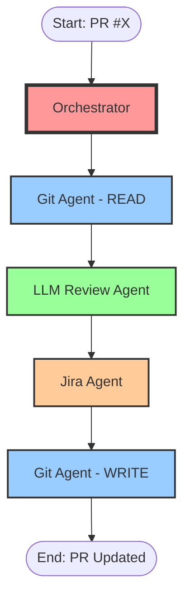
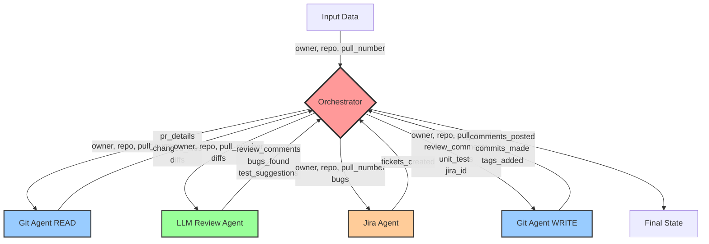
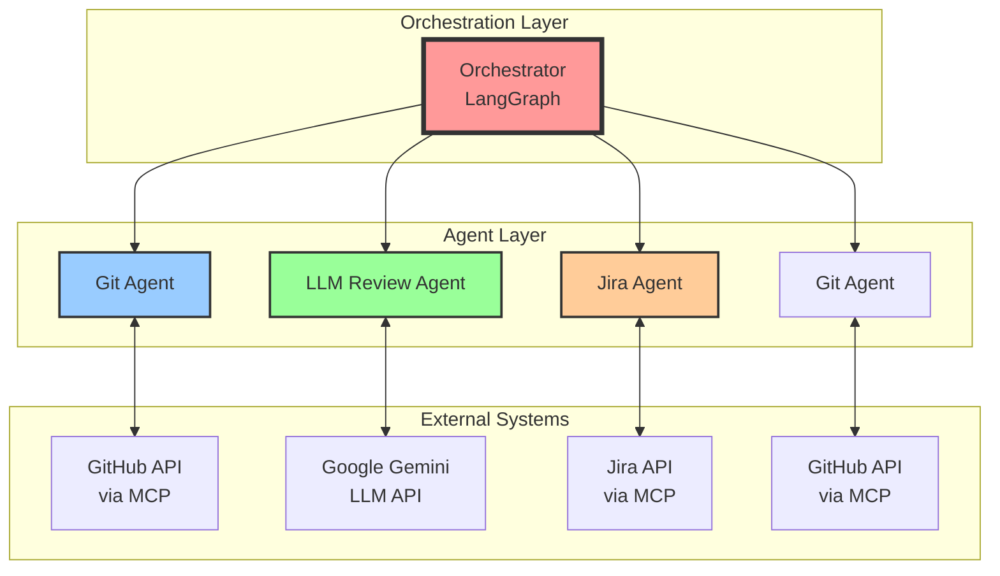

# ReviewerAgent - Architecture Diagram

## High-Level Architecture



## Data Schema Flow



## Component Interaction Map



## State Management

```mermaid
stateDiagram-v2
    [*] --> OrchestratorInit: Start
    
    OrchestratorInit --> GitRead: Initialize State
    
    state GitRead {
        [*] --> ConnectMCP
        ConnectMCP --> FetchPR
        FetchPR --> FetchFiles
        FetchFiles --> ExtractDiffs
        ExtractDiffs --> [*]
    }
    
    GitRead --> LLMReview: Pass Diffs
    
    state LLMReview {
        [*] --> AnalyzeCode
        AnalyzeCode --> GenerateReview
        GenerateReview --> IdentifyBugs
        IdentifyBugs --> SuggestTests
        SuggestTests --> [*]
    }
    
    LLMReview --> JiraTickets: Pass Bugs
    
    state JiraTickets {
        [*] --> ConnectJira
        ConnectJira --> CreateTickets
        CreateTickets --> [*]
    }
    
    JiraTickets --> GitWrite: Pass Ticket IDs
    
    state GitWrite {
        [*] --> PostComments
        PostComments --> CommitTests
        CommitTests --> TagPR
        TagPR --> [*]
    }
    
    GitWrite --> [*]: Complete
```



## Legend

- **Red** = Orchestrator (Main coordinator)
- **Blue** = Git Agent (GitHub integration)
- **Green** = LLM Review Agent (AI analysis)
- **Orange** = Jira Agent (Ticket management)

## Key Data Structures

### OrchestratorState
```
{
  owner: str
  repo: str
  pull_number: int
  git_read_result: {pr_details, changed_files, diffs}
  llm_review_result: {comments, tests, bugs}
  jira_result: {tickets_created}
  git_write_result: {comments_posted, commits_made, tags_added}
}
```

### GitAgentState
```
{
  owner, repo, pull_number
  client: MCP Client
  pr_details, changed_files, diffs  (READ)
  review_comments, unit_tests, jira_id  (WRITE)
  comments_posted, commits_made, tags_added  (OUTPUT)
}
```

### LLMReviewAgentState
```
{
  owner, repo, pull_number
  diffs  (INPUT)
  llm_analysis
  review_comments, bugs_found, test_suggestions  (OUTPUT)
}
```

### JiraAgentState
```
{
  owner, repo, pull_number
  bugs  (INPUT)
  jira_client
  tickets_created  (OUTPUT)
}
```